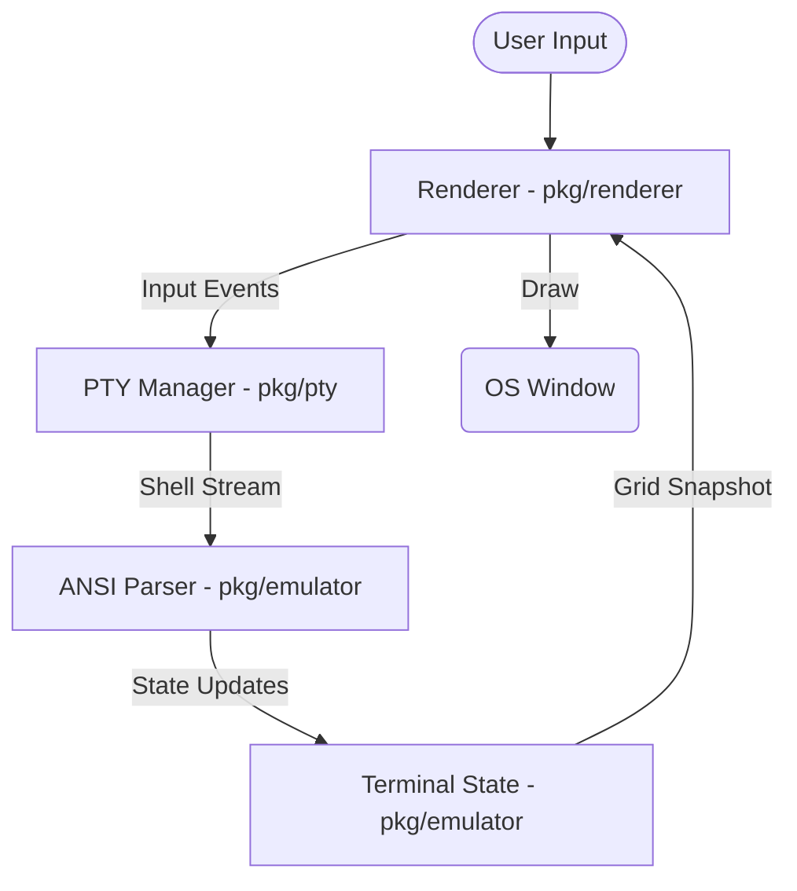

# Gritty

Gritty is a high-performance terminal emulator built in Go, designed for speed and visual excellence. It leverages the [Ebitengine](https://ebitengine.org/) game engine for GPU-accelerated rendering and features a custom-built terminal emulator and PTY manager.


## Features

- **Blazing Fast Rendering**: Custom raster-based renderer with dirty-region tracking to minimize CPU usage.
- **GPU-Accelerated Glyph Cache**: Efficient rendering of text using a dynamic glyph cache.
- **Nerd Font Support**: Full support for Nerd Fonts and modern typography.
- **Adaptive Theming**: Automatically detects system dark mode and adjusts themes accordingly.
- **Smooth Scrolling**: Optimized scroll performance with alternate screen handling (e.g., for `vim`, `less`).
- **macOS Integration**: Easily packageable as a native `.app` bundle.

## Architecture

Gritty is designed with a modular architecture, separating the display logic from the terminal state and process management.



### Core Components

- **`pkg/renderer`**: The graphics engine. It uses Ebitengine to draw characters to an off-screen buffer and mirrors it to the screen. It implements efficient dirty-cell tracking and a GPU-resident glyph cache.
- **`pkg/emulator`**: The brains of the terminal. It parses ANSI/VT escape sequences, manages the text grid, handles scrollback buffers, and maintains terminal modes (like alternate screen mode).
- **`pkg/pty`**: The bridge to the operating system. It spawns the shell process, manages its lifecycle, and handles I/O between the terminal and the shell.
- **`cmd/term`**: The application entry point that wires all components together.

## Getting Started

### Prerequisites

- **Go**: Version 1.25 or later.
- **Dependencies**:
  - `ebitengine/v2`
  - `creack/pty`
  - `golang.org/x/image`

### Running for Development

```bash
make run
```

### Building

To build a standalone binary:

```bash
make build
```

### Packaging for macOS

To create a native `Gritty.app` requires Ebitengine

```bash
make build-mac
```

## Verification & Testing

Gritty includes a Python-based verification script to test terminal capabilities like colors, Nerd Font icons, and emoji rendering.

```bash
python3 verify_terminal.py
```

## Troubleshooting

- **Fonts**: If icons don't appear correctly, ensure you have a [Nerd Font](https://www.nerdfonts.com/) installed and that it's being picked up by the system.
- **Performance**: High CPU usage may occur if the terminal is flooded with output. Dirty-region tracking helps, but extremely high-throughput streams are still being optimized.

## Contributing

Gritty is an open-source project. We welcome contributions in the form of bug reports, feature requests, and pull requests.

## License

[MIT License](LICENSE) (or whatever license you prefer)
